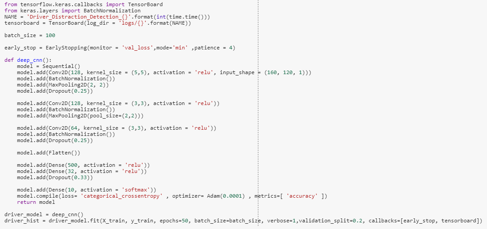
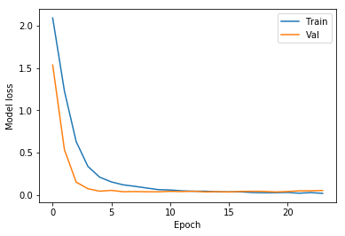
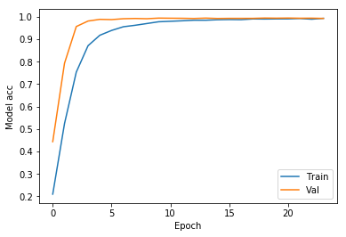
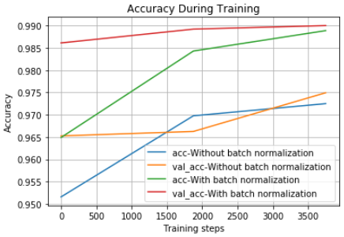

# Distracted-Driver-Detection-using-deep-CNN
  This project is to detect whether the driver driving the car is doing any activity that can cause accident. We have driver images each taken in a car with a driver doing something in the car(Texting, Eating, Talking, Grooming, Reaching behind, Etc.). Goal is to predict the likelihood of what activity driver is doing in each picture.

The 10 classes to predict are:

c0: safe driving

c1: texting - right

c2: talking on the phone - right

c3: texting - left

c4: talking on the phone - left

c5: operating the radio

c6: drinking

c7: reaching behind

c8: hair and makeup

c9: talking to passenger

### Initial thoughts on solution

initially thought simple CNN Architecture will perform good with any accuracy of atleast 50%. But when implemented it performs opposite to i expected. Accuracy is not even 11%. So thought to go for advanced CNN architecture with more CNN layers to make model to understand the data more precisely.

### Problems Faced + Experiments

There are 10 folders in Training data and each folder contains images of drivers with different activities. There are totally 22424 images in training data. These images are evenly spread. so the data seems to be well balanced.

Do to hardware limitations initially i planned to select only 1/4th chuck of data amoung 22424 images lets say 500 images on each folder that will gives a whole set of 5000 images...

But accuracy seems to be very low as it performed very low to gather the information on simple to advanced CNN architectures.
When build the model with simple CNN with two layers of (convolution, MaxPooling, and Dropouts) and trained performance was very poor and accuracy didnt even crossed 10%. I experimented with increase in size of the filters as well as increase in no. of feature maps. But nothings seems to be worked well.

On experimenting futher found that adding one more layers with more feature maps give better performance and accuracy.

intially i build a model with 2 convolution layers with 64 maps of size 5 by 5, this model performs very poorly.

On second trail build a model with 3 layers of convolutions with 128 by 128 by 64 maps and found this gives great accuracy compared to intial attempt.

Finally build model more robustly by adding Batch normalisation to each Convolution layers and this performs even better...

***Libraries used***

1. glob
2. pandas
3. numpy
4. matplotlib
5. H5PY
6. Keras
7. PIL

***CNN Architecture***

***Deep CNN Architecture***

### Performance

When Using CNN that given accuracy of 10 % on training and 8.38 % on validation data on training around 60 epochs.

When using adv_CNN that given accuracy of 99 % on training and 98.40 % on validation data on training around 18 epochs.

When using adv_CNN that given accuracy of 99.34 % on training and 99.30 % on validation data on training around 26 epochs.

No futher imporvement is noted as i used advantage of Earlystopping. 

On unseen data it predicted with accuracy of 99.75% with CNN using Batch Normalisation. and 99.37% with CNN without Batch Normalisation

***Model loss perfomance of Advance CNN***

***Model Accuracy performance of Advance CNN***

 

***Model loss perfomance of Advance CNN with batch normalisation***

***Model Accuracy perfomance of Advance CNN with batch normalisation***

## Notes

***Batch Normalisation*** = Batch Normalization is used to normalize the input layer as well as hidden layers by adjusting mean and scaling of the activations. Because of this normalizing effect with additional layer in deep neural networks, the network can use higher learning rate without vanishing or exploding gradients

                                                    *graph form the Internet*

***Relu Activation*** = ReLU stands for rectified linear unit, and is a type of activation function. Mathematically, it is defined as y = max(0, x). Visually, it looks like the following:

           * source link : https://medium.com/tinymind/a-practical-guide-to-relu-b83ca804f1f7 *

***Early Stopping*** = In machine learning, early stopping is a form of regularization used to avoid overfitting when training a learner with an iterative method, such as gradient descent. Such methods update the learner so as to make it better fit the training data with each iteration. Up to a point, this improves the learner's performance on data outside of the training set. Past that point, however, improving the learner's fit to the training data comes at the expense of increased generalization error. Early stopping rules provide guidance as to how many iterations can be run before the learner begins to over-fit. Early stopping rules have been employed in many different machine learning methods, with varying amounts of theoretical foundation.

***Convolutional Neural Networks***

In deep learning, a convolutional neural network (CNN, or ConvNet) is a class of deep neural networks, most commonly applied to analyzing visual imagery.

CNNs are regularized versions of multilayer perceptrons. Multilayer perceptrons usually refer to fully connected networks, that is, each neuron in one layer is connected to all neurons in the next layer. The "fully-connectedness" of these networks make them prone to overfitting data. Typical ways of regularization includes adding some form of magnitude measurement of weights to the loss function. However, CNNs take a different approach towards regularization: they take advantage of the hierarchical pattern in data and assemble more complex patterns using smaller and simpler patterns. Therefore, on the scale of connectedness and complexity, CNNs are on the lower extreme.

Convolutional networks were inspired by biological processes in that the connectivity pattern between neurons resembles the organization of the animal visual cortex. Individual cortical neurons respond to stimuli only in a restricted region of the visual field known as the receptive field. The receptive fields of different neurons partially overlap such that they cover the entire visual field.

CNNs use relatively little pre-processing compared to other image classification algorithms. This means that the network learns the filters that in traditional algorithms were hand-engineered. This independence from prior knowledge and human effort in feature design is a major advantage.

They have applications in image and video recognition, recommender systems, image classification, medical image analysis, and natural language processing.

*Source is wikipedia*
